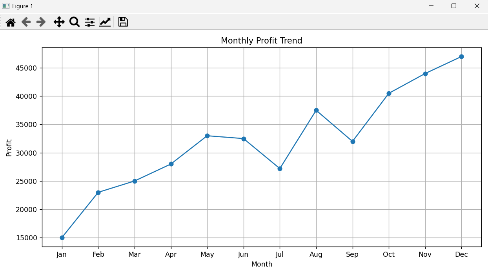
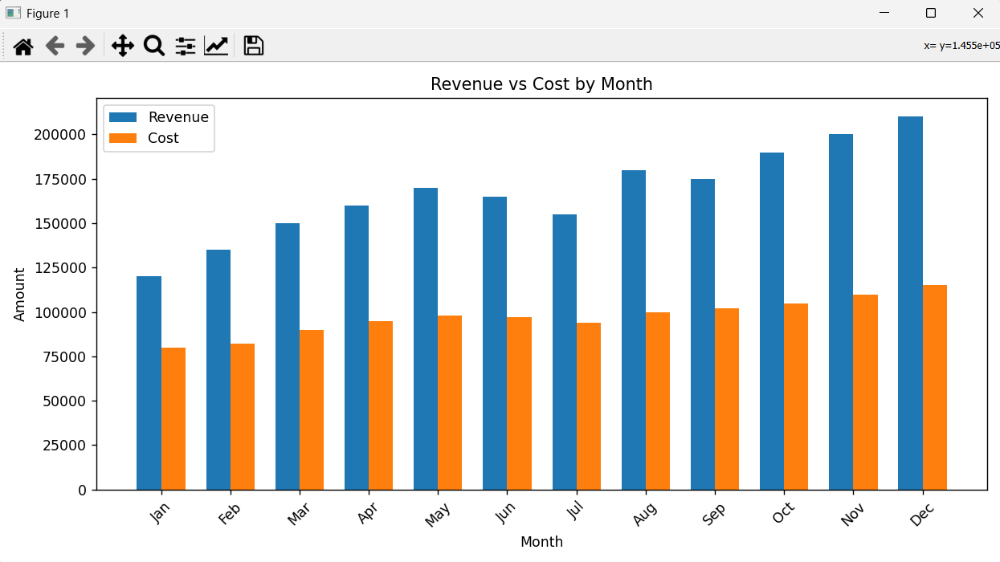
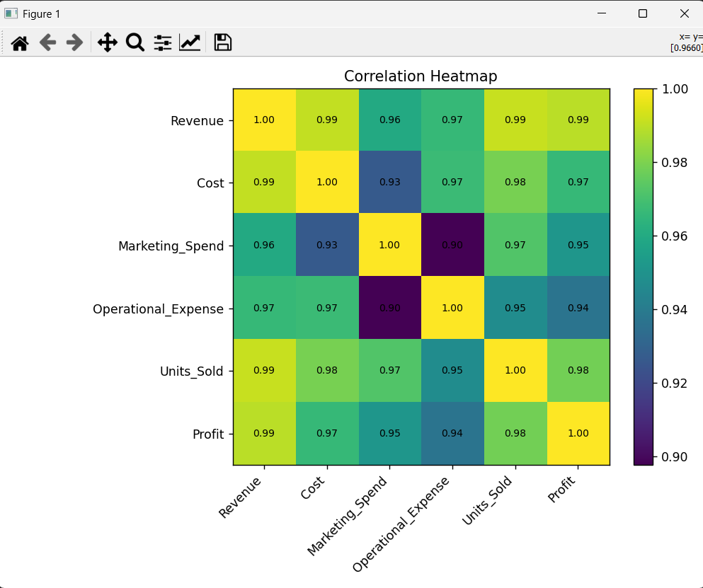

# profit-analysis
Business Profit Analysis

A multivariable business dataset analyzed to identify major profit drivers, cost contributors, and revenue patterns.

✔ Key Objectives

Clean and transform business data

Create new metrics such as Profit

Understand how Revenue, Cost, and Operational Expenses affect Profit

Visualize profit trends and correlations

Build interactive dashboard (Power BI)

🛠 Tech Used

Python (Pandas, Matplotlib, Seaborn)

Jupyter Notebook

🔍 Features & Insights

Profit trend analysis

Revenue vs cost comparison

Correlation heatmap to identify drivers

Region or product-level insights (if data supports it)

Dashboard showing KPIs such as:

Total Revenue

Total Profit

Total Orders / Quantity

Monthly Profit Trend

📸 Output Screenshots

